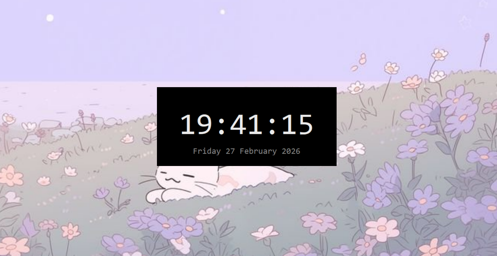

# 🖤 AMOLED Minimal Digital Clock

A real-time digital clock built using Python and Tkinter.

## Features
- True black AMOLED theme
- Live system time
- Date display
- Minimal UI

## How to Run

Make sure Python is installed.

### Run:
python digital_clock.py

## Technologies Used
- Python
- Tkinter
## 📸 Preview

